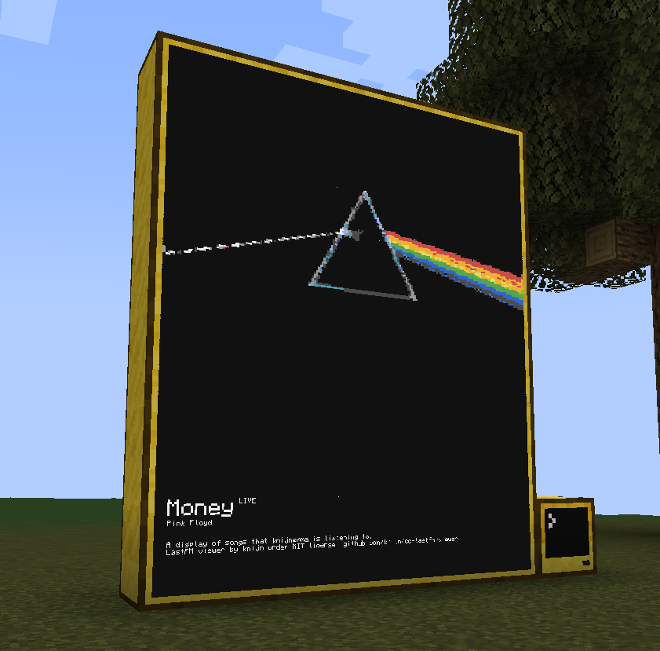

# cc-lastfm-viewer
A "currently playing" type viewer for Last.FM in CC

You'll need the following files for this to work
- bigfont.lua
- png.lua
- startup.lua
- config.lua

You'll need to create an API key for Last.FM for this to work!

## A special thanks to
- 9551-Dev (png reader)
- Wojbie (bigfont)